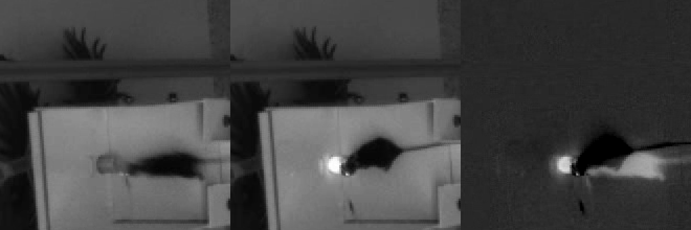

# Plan — adding reward outcome to the pipeline

Status: **conceptual plan, no code written yet** (2026-09-04).
Companion document: [bpod_reward_log_anomalies.md](bpod_reward_log_anomalies.md).

---

## 0. What the Bpod logs actually contain

Read from `/media/toor/SeagateClean/Bpod Local/` (protocols + `Data/Mouse<ID>/<Protocol>/Session Data/*.mat`,
MATLAB v5 files → `scipy.io.loadmat`). Per session the `SessionData` struct gives:

| Field | Meaning |
|---|---|
| `Info.SessionStartTime_UTC` / `SessionDate` | wall-clock session start (**local time, despite the "UTC" name**); identical to the timestamp in the filename |
| `TrialStartTimestamp` / `TrialEndTimestamp` | `(1, nTrials)` seconds since Bpod session start |
| `RawEvents.Trial{i}.States.Reward` | `[t_on, t_off]` **within-trial** seconds — valve open window |
| `RawEvents.Trial{i}.States.ReturnMiddle` | T-maze only — one row per **error** (wrong-arm poke) |
| `RawEvents.Trial{i}.Events.Port<N>In/Out` | every nose-poke, within-trial seconds |
| `TrialTypes` | which port was baited on that trial |
| `LightOnTrials` | **TMaze4 only** — which trials had the cue LED on |

Absolute time of a reward = `session_start + TrialStartTimestamp[i] + States.Reward[i][0]`.

### The single most important structural fact

**Every trial that appears in a Bpod log is a rewarded trial.** In both protocols the
`WaitForPoke` state can only be left by poking the correct port (→ `Reward`) or, in the T-maze, an
incorrect port (→ `ReturnMiddle`, which loops back to `WaitForPoke`); a trial is only appended to
`SessionData` once `RunStateMachine` returns. The only exception is the linear track's session
timeout (`Timer = totalSessionTime - timeElapsed`, `Tup → exit`), which produces one unrewarded
final trial (`States.Reward = NaN`) in sessions that ran the full 30 min.

So the Bpod log is **not** a rewarded/unrewarded label per behavioural trial. The reward/no-reward
distinction has to be created by joining Bpod's rewarded events onto the *behaviour*-derived trials
from `Linear_combined_pipeline.ipynb` / `TMaze_combined_pipeline.ipynb`, which segment **every**
port-to-port traversal — including unrewarded ones:

* **Linear track** — the state machine strictly alternates the baited port (`TrialTypes` = `1,2,1,2,…`;
  1 → `Port4In`, 2 → `Port2In`). Running back to the port you were *just* rewarded at does nothing:
  the poke shows up in `Events.Port4In` but causes no state change. Those are the unrewarded trials.
* **T-maze** — each `ReturnMiddle` entry inside a Bpod trial is one wrong-arm visit; the behaviour
  pipeline sees it as its own trial, and it is unrewarded.

### Port → arena mapping

| Protocol | Port 1 | Port 2 | Port 3 | Port 4 | Port 5 |
|---|---|---|---|---|---|
| `LinearTrack` | — | "right" end | — | "left" end | — |
| `TMaze2` | middle | left | right | — | — |
| `TMaze4` | middle | — | left | — | right |

`TMaze2` and `TMaze4` use **different port numbering** — do not hard-code one mapping.

### LED / valve behaviour (the video signature)

| Protocol | LED while waiting | LED + valve at reward |
|---|---|---|
| `LinearTrack` | **off** | LED + valve on the rewarded port for `GetValveTimes(20 µl)` ≈ **70–120 ms** |
| `TMaze2` | **always on**, on the baited port, for the whole trial | LED stays on, valve opens ~85–115 ms |
| `TMaze4` | on **only** for trials in `LightOnTrials` | same |
| both T-mazes | middle-port LED on for the whole `ReturnMiddle` (error) state — **no water** | — |

`TMaze4` draws `LightOnTrials = randperm(90, 45)` over the *maximum* 90 trials, but sessions end
after ~15–35 trials, so in practice only a **small, random fraction** of completed trials are cued —
e.g. 5 of 34 in `Mouse944_TMaze4_20260723_153813`. Never assume 50%.

---

## 1. Feasibility check already run (2026-09-04)

Test session: `Mouse944 / Round1 / Linear / 2026-07-13T15_55_27` vs.
`Mouse944_LinearTrack_20260713_160106.mat` (78 trials).

1. Took the mouse's DLC x-range in the trim window to place two 220×220 px ROIs on the track ends
   (x ≈ 210 and x ≈ 1777, y ≈ 660).
2. Per frame, `p99.5` of ROI intensity, minus a 151-frame rolling median (removes lighting drift and
   the mouse's slow occlusion of the port).
3. Mapped Bpod time → frame index through the session's `timestamps*.csv` (see §2) and
   cross-correlated against the reward train, split by `TrialTypes`.

Result:

| ROI | trial type | best residual lag | z |
|---|---|---|---|
| left (x≈210) | 1 (`Port4`) | **+0.88 s** | **15.1** |
| right (x≈1777) | 2 (`Port2`) | **+0.92 s** | **14.9** |
| left | 2 | +8.04 s | 6.4 |
| right | 1 | −6.20 s | 3.9 |

The two correct pairings agree on the same residual lag and beat the cross pairings by a wide
margin, which simultaneously (a) confirms the port→side mapping, (b) recovers the clock offset, and
(c) shows the event is individually visible: median ROI transient at reward = 106 (left) / 36
(right) grey levels above baseline. A difference image at a single reward frame shows a saturated,
compact (~20×20 px) LED blob at the mouse's nose. **The approach works.**

*Mouse944, 2026-07-13, left port. Left: 8 frames before the valve opens. Middle: valve frame — the
LED blob is at the mouse's nose. Right: difference of the two.*

The residual **+0.9 s** is the Bpod-PC-vs-acquisition-PC clock offset (plus a little smearing from
the filters) — small, constant within a session, and exactly what step 3 below is designed to
estimate per session rather than assume.

---

## 2. The alignment substrate: `timestamps*.csv`

* There is **no hardware sync** between Bpod and the miniscope. A scan of every event channel across
  the whole dataset finds only `Port<N>In/Out` and `Tup` — no `BNC*`, no `Wire*`. Alignment must be
  inferred.
* `timestamps<TIMESTAMP>.csv` is the anchor: one row per frame, absolute wall-clock with sub-ms
  precision and a UTC offset (`2026-06-30T15:05:24.0566784-07:00`). Row count == frame count exactly,
  for Miniscope, Home *and* Linear (verified: 44880 rows == 44880 frames in all three).
* **Never use `frame_index / 25`.** Real capture rate is ~24.8–24.9 fps, so the nominal 960 s trim is
  really ~964–975 s of wall-clock (median 964.8 s over 497 clean sessions); the error grows to
  several seconds by the end of a clip — enough to slide a reward onto the neighbouring T-maze trial.
* For concatenated (young-cohort) sessions the CSV **preserves the real gaps between sub-recordings**
  while the video splices them with no gap. Row *i* still corresponds to frame *i*, so per-frame
  timestamps stay correct — but elapsed wall-clock inside a "960 s" clip can be far longer. 83 of 642
  trimmed windows contain a >2 s gap; the worst is 702 s. This is another reason to key everything
  off the CSV rather than a frame rate.
* Only **60 of 646** session folders keep their own `timestamps*.csv`; the rest must be found
  elsewhere, and the same filename timestamp can match several files including short aborted stubs
  (e.g. `2025-12-17T17_05_56` matches a 14-row stub *and* the real 42612-row concat). The rule should
  be: take it from `RAW_DATA/<TIMESTAMP>/`, and **validate `n_rows == n_frames` of the raw Miniscope
  video** before using it; copy it into the trimmed session folder so downstream steps don't have to
  search.

---

## 3. Proposed procedure

Runs **after** trimming (step 5) and behaviour trial segmentation (step 9), before the megadata
table in `stability-analysis`. Written as one new script, `extract_rewards.py`, per session.

### 3a. Read the Bpod log(s) for the session
Resolve candidate `.mat` files by mouse + calendar date + task, then pick by overlap with the video
window, not by nearest start time (see the anomalies doc — restarts, and the T-maze folder mislabels).
Build a tidy table: `bpod_trial`, `trial_type`, `port`, `t_reward_on`, `t_reward_off`, `n_errors`,
`error_ports`, `cue_led_on`, all in **absolute local wall-clock**.

### 3b. Detect reward flushes in the behaviour video
* Place a small ROI (~40×40 px, tighter than the 220 px used in the feasibility test) on each water
  port. Seed positions from the DLC trajectory extremes / existing `PORT_ROIS_DEFAULT`, then refine
  once per mouse-and-camera-position by looking at a reward-triggered difference image, and store
  them in a per-mouse dict beside `CROPS`.
* Per frame, take a high percentile of ROI intensity minus a rolling median; call candidate events
  where it crosses a robust threshold for 1–4 frames (valve is 70–120 ms ≈ 2–3 frames).
* **Linear track**: this is clean — the LED is off except at reward.
* **T-maze**: the LED confound is real and protocol-dependent. Detect the *transitions*, not the
  level: the reward-relevant events are (i) LED **onset** on a non-cued trial, and (ii) LED
  **offset** at the end of `Reward` on a cued trial. Additionally the water meniscus movement is a
  separate, LED-independent signal in the same ROI. In `TMaze2` (LED always on) the offset edge is
  the only usable one. Because a lit middle port also means "go back to the middle" (`ReturnMiddle`,
  no water), **middle-port illumination must never be read as reward on its own.**

### 3c. Estimate the session clock offset
Cross-correlate the per-port video event train against the Bpod reward train (split by port) over a
±300 s lag window, exactly as in §1. Accept the session only if:
* the peak z exceeds a threshold, **and**
* the correct port pairings beat the swapped pairings, **and**
* the recovered offset is consistent across ports.

This is the QC gate. It replaces trusting filename timestamps, which are good to ±30 s only 56% of
the time. Fit offset (and, for concatenated sessions, check for a per-segment offset) rather than a
single global constant.

### 3d. Match video events to Bpod rewards
After applying the offset, greedily one-to-one match video events to Bpod rewards within a small
window (~±0.5 s). Record per Bpod reward: `matched` / `video_only` / `bpod_only`. `video_only`
events are the diagnostic for a mis-chosen Bpod log (e.g. the wrong half of a restart day);
`bpod_only` means the port was occluded by the mouse or the ROI is misplaced.

**Bpod times are the timing of record; the video is the verification channel.** For sessions where
alignment fails QC, fall back to video-only reward times with a `reward_source = "video"` flag, and
for sessions with no Bpod log at all (34 of them, see anomalies doc) the video is the *only* source.

### 3e. Attach reward to behavioural trials
Convert each accepted reward time to a **frame index** via the session's `timestamps*.csv`, then to
`frame_local` (subtract `dlc_trim_info.csv:start_frame`). Add to the trial table produced by
`Linear_combined_pipeline.ipynb` / `TMaze_combined_pipeline.ipynb`:

| Column | Meaning |
|---|---|
| `rewarded` | bool — a reward fell inside this trial's `[start_frame, end_frame]` (+ a small tail) |
| `reward_frame_local` | frame of valve onset, or `NA` |
| `reward_port` | Bpod port number |
| `reward_source` | `bpod+video` / `bpod` / `video` |
| `reward_latency_s` | valve onset − trial end (should be small and positive) |
| `cue_led_on` | T-maze — was the port cued this trial (`TMaze4` `LightOnTrials`, always `True` for `TMaze2`) |
| `bpod_trial` | index into the Bpod log, for traceability |

A trial with no matching reward is `rewarded = False` — this is where the actual reward/no-reward
contrast comes from, per §0.

Then propagate `rewarded` / `reward_port` / `cue_led_on` from the trial table into
`*_linearized_binned_trials_*nbins.csv` (they are constant within a trial), so the
`stability-analysis` megadata builder picks them up with no change to its join logic — it already
carries `trial_type` and `trial_id` per `(session, neuron, trial, bin)` row.

### 3f. Per-session audit output
Write `reward_info.csv` (one row per reward) and `reward_qc.json` (offset, z, match counts, which
Bpod file was used, which timestamps file was used) into the session folder, alongside
`dlc_trim_info.csv`. Same pattern as `denoise_log.csv`.

---

## 4. Order of work

1. `extract_rewards.py` §3a only — parse every `.mat` into a tidy per-session reward table, with the
   resolver from §3a. Cheap, and immediately gives a dataset-wide reward inventory.
2. Video detector §3b + offset fit §3c on Mouse944 linear (already validated) → then a T-maze session
   → then one session per mouse to fix ROIs and thresholds per camera setup.
3. §3d–§3f, then re-run the two behaviour pipelines to emit the new columns.
4. Only then touch `stability-analysis`.

Validation targets, cheap and worth asserting:
* Linear track: `n_rewards == nTrials` (minus one for the timeout trial), rewards strictly alternate ports.
* T-maze: reward port always equals the port implied by `TrialTypes`.
* Every matched reward frame lands within a trial the behaviour pipeline classified as ending at that port.

---

## 5. Inventories generated while writing this plan

`docs/bpod_session_inventory.csv`, `docs/bpod_video_pairing.csv`, `docs/session_frameclock_gaps.csv`
— described at the end of [bpod_reward_log_anomalies.md](bpod_reward_log_anomalies.md).
